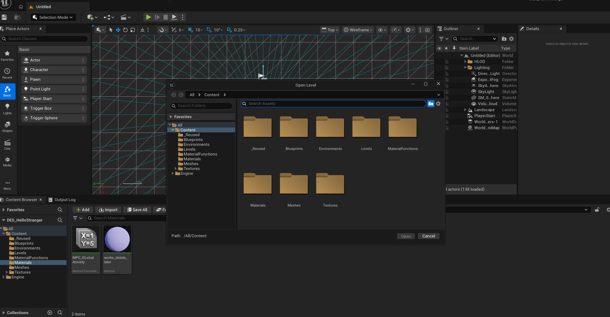

# DES307
## 02 May 2026

## Pitch

Happy with the my pitch deck but not my presentation, ended up going completely off script.

Feedback from Dr Toby Gifford - nudged me toward thinking about proxitimy bubbles for the users as this would serve as their 'window' into the installation - something I want to try and certainly explore.

An interesting limitation is media pipe only tracks one pose/skeleton as its a single person pose estimation which is a core design constraint I will consider.

Currently it is a 'solo' experience, though multiuser interaction could be possible using another data point, possibly faces. This has negative and positives for the artifact - having to do an absurd notion is even more relatable in the context of social anxiety, I would expect people to have trepedation entering into the Cave2 and not knowing what to expect or 'how' to perform.

It will be interesting to see if I can balance that tension, since I don't want it to be a bad experience - if the performance of the people is more joyous and memoriable in a group (which I suspect it would be) I see more value in bringing joy than discomfort.

