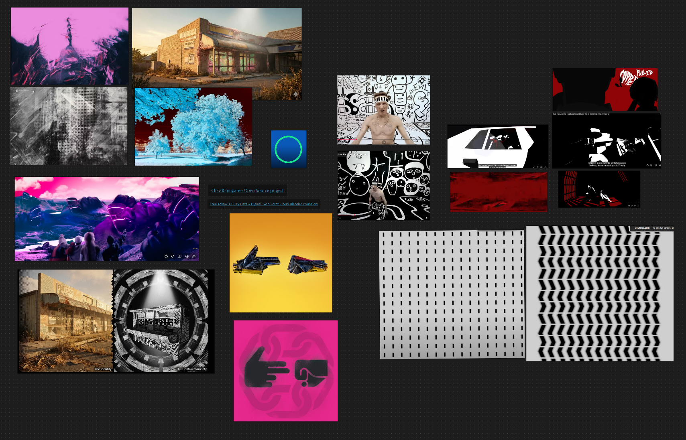
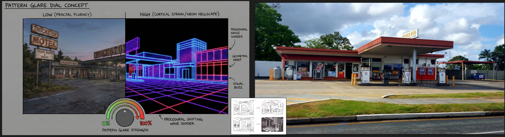
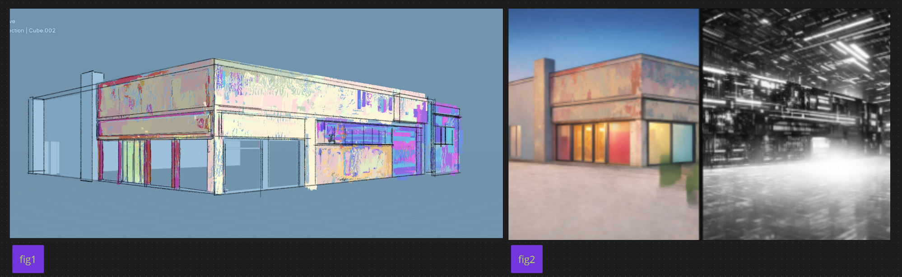

The packed mask system worked fairly well, the packed mask was too repititous when viewed at a low angle to the ground. 
I noticed a channel for vertex painting, a quick look at unreal documents meant I could also paint a vertex RGB which would be essentially free.

Of course the limitation of vertices on the modular kit means painting large blobs of black and white values in the RGB channels is enough to break up some of the more aggresive tiling patterns.

Its quite a flexible little weathering system.

Coming into the final week I had a lot of assets left to create. I took some time to get out from behind the computer and take some local photos of my local (down the road) Kensington Village. Although my phone camera is a low resolution I'm going to lean into using local photos and running it through Substance Sampler. 
This project only feels correct to me if it is using local textures for a bit more authenticy. 

This will be a drop in quality (my camera, time) but the quality isn't really the point of this. Its to take a slice of suburbia and explore the concrete fabricated nature of these places.
Without being edgy 

### 28.05.2026

