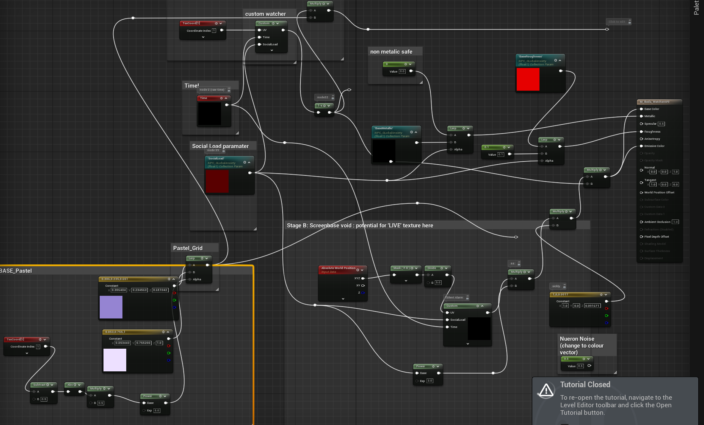

# Journal Entry - April 10, 2026

## Todays Reflection
This is where my stuff goes 

## Learnings
- First thing
- Second thing

# Journal Entry - April 17 2026

## Todays Refletion
- Todays class we looked further into mediapipe and using mediapipe (release!) to take data from the mediapipe.tox and extract specific sub tox's, this allows us to take the main mediapipia pipe tox, as well as specific tox's for object detection, hands, create a DAT, have a constant look through the DAT table and get the relevant information.
- This will then be handled by an event handler in Unreal Blueprint to recieve that data live over OSC.

-Likely will have to use TouchDesigner to capture the webcam stream and use mediapipe object detection to return N people detected.

-Might need to set a confidence threshold.

Keep the smiley faces happy (new concept) showing the why it reacts for user feedback.
