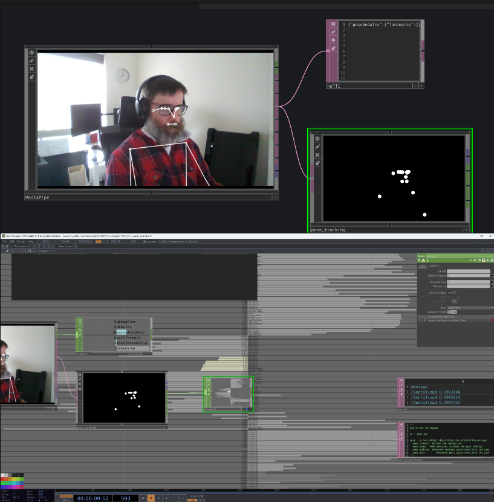

# Hello Stranger — Dev Journal
24.04.2026
Week 7

## Workshop - 7 ##

Covering OSC in detail from the workshop was fascinating, with Dr Toby Giffords help setup a Touchdesigner file using OSC out CHOP ticks a message to localhost (127.0.0.1) being UDP this makes transfer very fast. Also using a DAT callback to visualise the data. This makes it easier to visualise exactly what is being communicated and where (eg a /SocialLoad 0.49385485 is a test from LFO)

Expanding on the Unreal able to create an OSC Blueprint to have an OSC server - get the float, print the string and control the MPC (Material Property Container?). Having it drive a material in realtime was a great milestone.

## Exact Interaction ##

After the workshop it was also clear I had not identified my exact interaction. I knew fundamentally I was shifting from one 'normal' material to 'overwhelming' but given the Cave2 environment I started to give more thought as to the experience and the drivers.

---

## Entry 1 — Mapping the signal chain

Started by trying to think through the whole pipeline before touching a single tool. Webcam → MediaPipe in TouchDesigner → some kind of stillness calculation → OSC out → Unreal receives it → drives a material parameter → world responds.

Two separate OSC messages makes the most sense:
- `/presence` (0 or 1) — gates whether the simulation runs at all
- `/socialLoad` (float 0→1) — drives how overwhelming the material gets

The "always pulsing" baseline lives entirely in the material itself (Time node × sine wave). OSC only modulates that pulse — it doesn't trigger it. So the heartbeat is always there, even when no one's in the room. SocialLoad just controls how *agitated* the heartbeat is.

Realised pretty quickly I was overcomplicating things. The Watcher windows from my original concept are interesting but a second interaction layer I don't need. SocialLoad is a strong enough throughline on its own.

---

## Entry 2 — Concept crit, honest version

The "Primal Alarm" name was bad and I knew it. Sounds like a fragrance. Workshopped a bunch of supermarket-coded alternatives — "Aisle 0", "Shrink", "Special Offer", "Do Not Freeze". Landed (for now) on **Hello Stranger**. A supermarket that addresses you as a stranger rather than a customer — captures the anxiety of public space in one phrase. Slightly wrong, slightly welcoming.

The non-place framing (Augé) is doing real work in this project. The supermarket isn't just a backdrop — it's an environment specifically designed to suppress identity and route bodies efficiently. That's the perfect arena for a piece about social anxiety and the freeze response.

Also reframed something important: this isn't an escape room. **It's a portrait.** The point isn't "solve the puzzle by moving" — it's "here is what anxiety feels like to inhabit." The piece doesn't need a clean resolution mechanic. It needs to be accurate.

That reframe solves the explicit-instruction problem too. I don't need to teach the visitor how to escape. I just need to put them inside the experience long enough that they feel the weight of managing it.

Dropped the camera shake stretch goal. Already enough going on, and camera manipulation in CAVE2 risks nausea.

Sound design — keeping the ideas (checkout beeps, fridge hum, muzak getting louder) but ditching binaural for now. Headphones complicate the CAVE2 setup. A simple amplitude/pitch ramp driven by SocialLoad is enough.

---

## Entry 3 — OSC pipeline, getting it working

Started building the actual Unreal Blueprint. My OSC receiver was technically working — messages were arriving — but I'd lost my print messages and the float wasn't getting into the Material Parameter Collection.

**What each Blueprint node actually does:**
- `Event BeginPlay` → `Create OSCServer` — spins up the listener at startup
- `SET Osc Reciever` — stores the server reference for later
- `Bind Event to On Osc Message Received` — registers the callback
- `onOSCMessageReceived` (custom event) — fires every time a message arrives
- `Get OSC Message Address` → returns the address string like `/socialLoad`
- `Get OSC Message Float At Index` → pulls the actual float value out of the message

OSC is genuinely simple — it's just an address and a list of values. Thought I needed to handle x,y,z type stuff but I'm only sending one float, so it's index 0 and that's it. The xyz example was confusing me — that's only relevant if you pack multiple values into a single message.

**Key fix:** all the message-handling nodes need to be in ONE execution chain hanging off `onOSCMessageReceived`, not branching off `Bind Event`. Bind Event runs once at startup — it doesn't carry the message data. The chain has to be: custom event → get address → convert → print → get float → set scalar parameter value.

---

## Entry 4 — TouchDesigner sending side

Built a quick test setup in TD: LFO CHOP → Math CHOP → OSC Out CHOP, plus an OSC In DAT to verify the loop. The default callback script is just boilerplate — I don't need to touch it. The OSC In DAT receives messages whether or not the callback does anything.

Found the `/_samplerate 60` ghost message in my stream — turns out that's because Data Format was set to "Time Slice" which auto-includes samplerate metadata. Switched to "Sample" mode and now I only send the message I actually want. Cleaner debug.

Renamed the channel so the OSC address comes through as `/socialLoad` instead of `/count`. The channel name in TouchDesigner becomes the OSC address — that's what I needed to know.

---

## Entry 5 — Port conflict, lesson learned

Tried to run the Unreal blueprint and got `Failed to bind OSCServer to 0.0.0.0:10000. Error code 20: SE_EADDRINUSE`. My TouchDesigner OSC In was already listening on port 10000 on the same machine — two programs can't both grab the same port. Each port is a single mailbox slot.

Changed Unreal to port 7000 (and updated TD to send to 7000) and everything works. Network interface doesn't matter — it's purely about which port number is free.

---

## Entry 6 — IT WORKS

Full pipeline operational. LFO ramping in TouchDesigner, OSC sending the float, Unreal receiving it, Material Parameter Collection updating, material visibly responding on the supermarket shelves. Watched the SocialLoad value tick down from 0.88 to 0.72 with the material fading from heavy pattern glare to calm.

Tried to call myself dumb afterwards and was reminded — that's the same freeze response the project is about, just applied to my own competence. Going to log that and move on.

---

## Entry 7 — Mapping the actual experience

Sketched out what the experience should feel like at different SocialLoad values. Not two states (calm/chaos) but a gradient with distinct character at each stage:

- **0.0–0.25 Rest** — calm pastel, gentle pulse, low hum. Slightly uncanny but normal.
- **0.25–0.50 Low anxiety** — faint zebra mask appearing, pulse faster (~80 bpm feel), checkout beeps layering. Maybe a "Hello Shopper" PA line.
- **0.50–0.75 Rising overload** — zebra dominates, products losing detail, pulse insistent (~110 bpm), beeps stacking, blood-rush undertone. PA becoming urgent: "Please keep moving."
- **0.75–1.0 Full overload** — Ikeda-style data noise, geometry fracturing, pulse maxed, all sound layers distorted. Maybe drop text entirely — visuals say enough.

Important realisation: this isn't four separate materials. It's ONE material with a SocialLoad input that just *looks like* these things at different points along the 0→1 range. Same math, same shader, different input number.

---

## Entry 8 — The bathtub realisation

The thing I struggled to articulate but finally got: **SocialLoad is always climbing while someone is in the space.** Movement doesn't win, it just buys time. It's a bathtub with the tap always running. Movement is pulling the plug — drains some water — but the tap never turns off.

The math:

```
SocialLoad = SocialLoad + growthRate − (movement × drainRate)
```

Tunable with two constants. `growthRate` (e.g. 0.010 per frame) and `drainRate` (e.g. 0.030). The only variable input is `movement` from MediaPipe (0 to 1).

Worked example with growth = 0.010, drain = 0.030:
- **Frozen** (movement = 0) → +0.010 per frame, climbs steadily
- **Fidget** (movement = 0.3) → +0.001 per frame, still climbs slowly
- **Walking** (movement = 0.5) → −0.005 per frame, finally draining
- **Thrash** (movement = 1.0) → −0.020 per frame, fast recovery

Clamp the result between 0 and 1. In TouchDesigner that's one Math CHOP and one Feedback CHOP. Simpler than it sounds.

This mechanic IS the metaphor. Anxiety doesn't resolve, it requires constant management. The visitor can't fix the space, only manage it. Stop managing → it escalates. Conceptually the most honest version of the piece.

---

## Week 7 — Material logic, high level

The material doesn't know about any of the bathtub math. It just receives SocialLoad (0→1) from the MPC and uses it for two things:

1. **Pulse speed** — `Time × Lerp(slow, fast, SocialLoad) → Sine`. At 0 the wave cycles slowly, at 1 it's panicked.
2. **Pulse intensity** — `Sine × Lerp(quiet, loud, SocialLoad)`. At 0 the pulse barely moves anything, at 1 it's driving the full effect.

That single pulsing value plugs into the zebra mask, UV distortion, emissive brightness — whatever visual effect needs to react. Pulse is the engine, SocialLoad is the throttle.

One material. Two lerps. One sine. Everything else is just plumbing.

---

## Status at end of week 7

- ✅ Concept solid, name working title
- ✅ Full OSC pipeline operational
- ✅ Material reacting to live float
- ✅ State map for the four anxiety zones
- ✅ Math model for the accumulator
- ⏳ Replace LFO test signal with real MediaPipe stillness calc
- ⏳ Build the actual zebra/glitch material
- ⏳ Sound layer
- ⏳ CAVE2 deployment

Hard plumbing done. Everything from here is creative work, which is the part I can actually do well.

# Week8
##27.04.26

Exploring mediapipe today as its the final peice of the puzzel for full end to end functionality

Remembering to externalise the RELEASE tox of media pipe and download the release version.



Seeing this realtime skeleton is always super impressive. Initially I wanted to get face data and use that to look for movement (even as a test) I went with wrists and shoulders. After consulting with AI (prompt below)

*Note: Middle mouse button on operators is a lifesaver for viewing this information.

## Claude question
Opus 4.6

What values am I looking at from a mediapipe poses, do I use the normalised output from the poses tox? Can I track wrists and shoulders?

**What MediaPipe is actually outputting for poses:**

Each pose landmark is a point with normalised coordinates — typically x, y (and z for depth, plus a visibility/confidence value). x and y come through as 0–1 across the frame width and height, so they're already nicely ranged. Z is depth from the camera plane, useful but noisier. For your project, x and y on a few key landmarks are plenty — z just adds jitter you'd have to filter.

There are 33 pose landmarks total (head, shoulders, elbows, wrists, hips, knees, ankles, etc.) but you don't need all of them. **For stillness detection, just track 3-5 reliable ones:** nose (head movement), both wrists (the most expressive joints), and maybe both shoulders as a backup. The hands and feet are noisy and often occluded — wrists are the sweet spot.

**Yes, velocity is exactly what you want.** Frame-to-frame position delta is your activity signal. Conceptually:

```
velocity = abs(landmark.x_now - landmark.x_lastframe) 
        + abs(landmark.y_now - landmark.y_lastframe)
```

Do that for each landmark you're tracking, sum or average them, smooth with a Lag CHOP so it's not jittery, and you have your `movement` value (0 = totally still, higher = moving).

**In TouchDesigner CHOP terms:**
1. Pull the x/y channels from your pose_tracking output for the landmarks you care about
2. **Slope CHOP** — gives you the rate of change between frames (this is velocity, basically a built-in delta)
3. **Math CHOP** set to absolute value (negative velocity is still movement)
4. Sum the channels together, or average them
5. **Lag CHOP** — smooths the spikes (try lag value of 0.3–0.5 seconds)
6. **Math CHOP** to normalise into a 0–1 range — you'll need to experiment with the multiplier based on what raw values you're seeing
7. That final 0–1 float is your `movement` input for the bathtub formula

The Slope CHOP is the trick that makes this clean — it does the frame-delta automatically so you don't need a Feedback CHOP just to get velocity.

**Quick sanity check before you build:** wire just one channel (say nose_x) into a Slope CHOP and watch the value. Stand still, it should hover near zero. Wave your hand in front of the camera, it should spike. Once that confirms, expand to multiple landmarks and tune from there.

---

### movement → multiply by drainRate (e.g. 0.03) → invert (negate) → add growthRate (e.g. 0.01) → add to feedback of previous SocialLoad → Limit clamp 0-1 → Feedback (loops back)

[img]=Current touch designer chain

###

After some testing going to drop the shoulder tracking and just do wrists 

left_wrist:[xy] right_wrist:[xy]

this seems to be the most stable at reading movement. If the Cave2 perhaps wrist bands can increase the detetction confidence?

Lag Chop is trying to smooth out the motions which can be jittery. I think it is also a case of a low quality webcam potentially.

```
Summary
The Lag CHOP adds lag and overshoot to channels. It can also limit the velocity and acceleration of channels. Lag slows down rapid changes in the input channels. Overshoot amplifies the changes in the input channels.

Two values exist for each parameter. For example, in the Lag effect, when the input channel value is rising, the first lag parameter is used, and when the channel value is decreasing, the second lag parameter is used. This can give a quick rise, and a slow fall. But lag up and down are often kept at the same value.

For a similar, less-abrupt effect, see the Filter CHOP.
```


Finding a sweet spot between noise and readability is tricky, a clamp at around -0.06 removes a lot of the lower end jitter by offsetting the floor.

Attempting to implement this code which AI gave me as an acumulator.

```
SocialLoad = SocialLoad + growthRate − (movement × drainRate)
```
