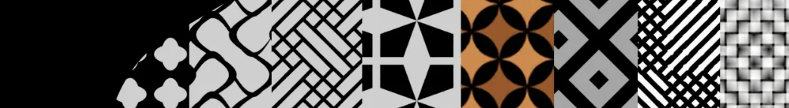
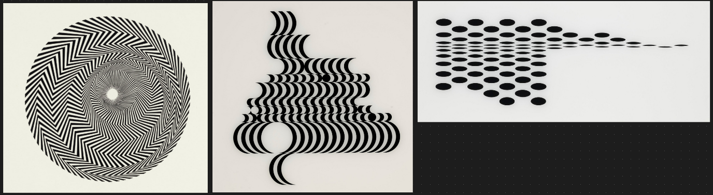
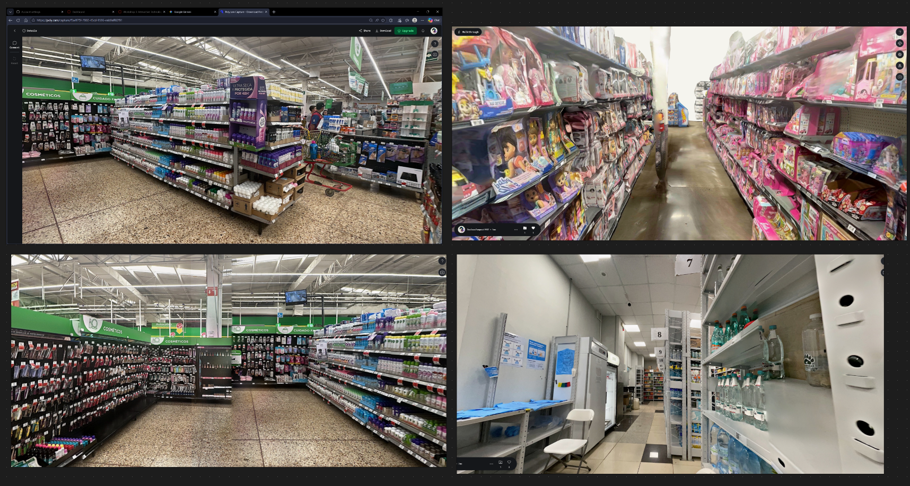
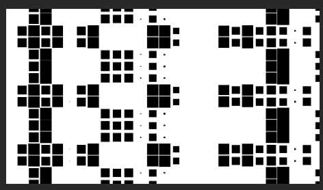
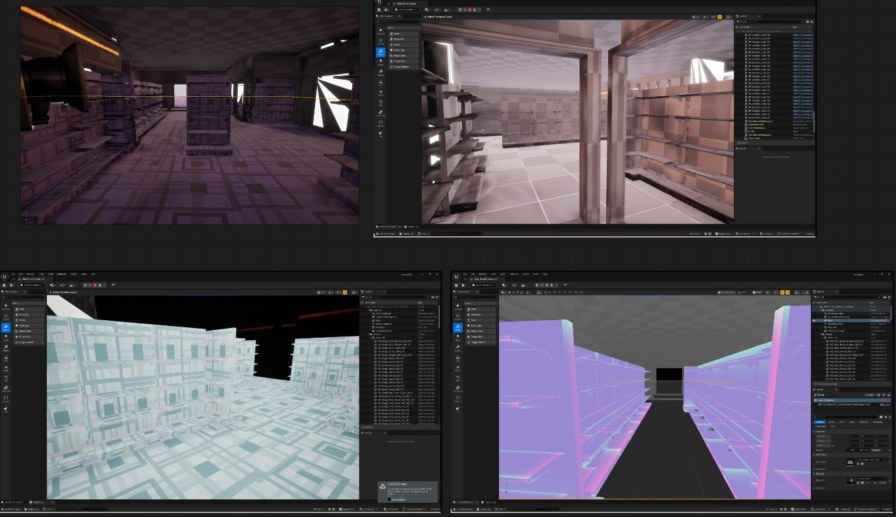
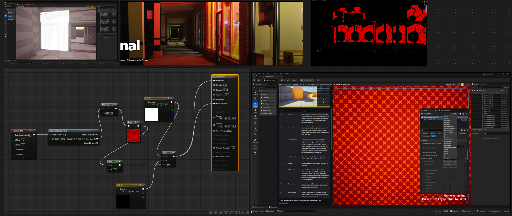
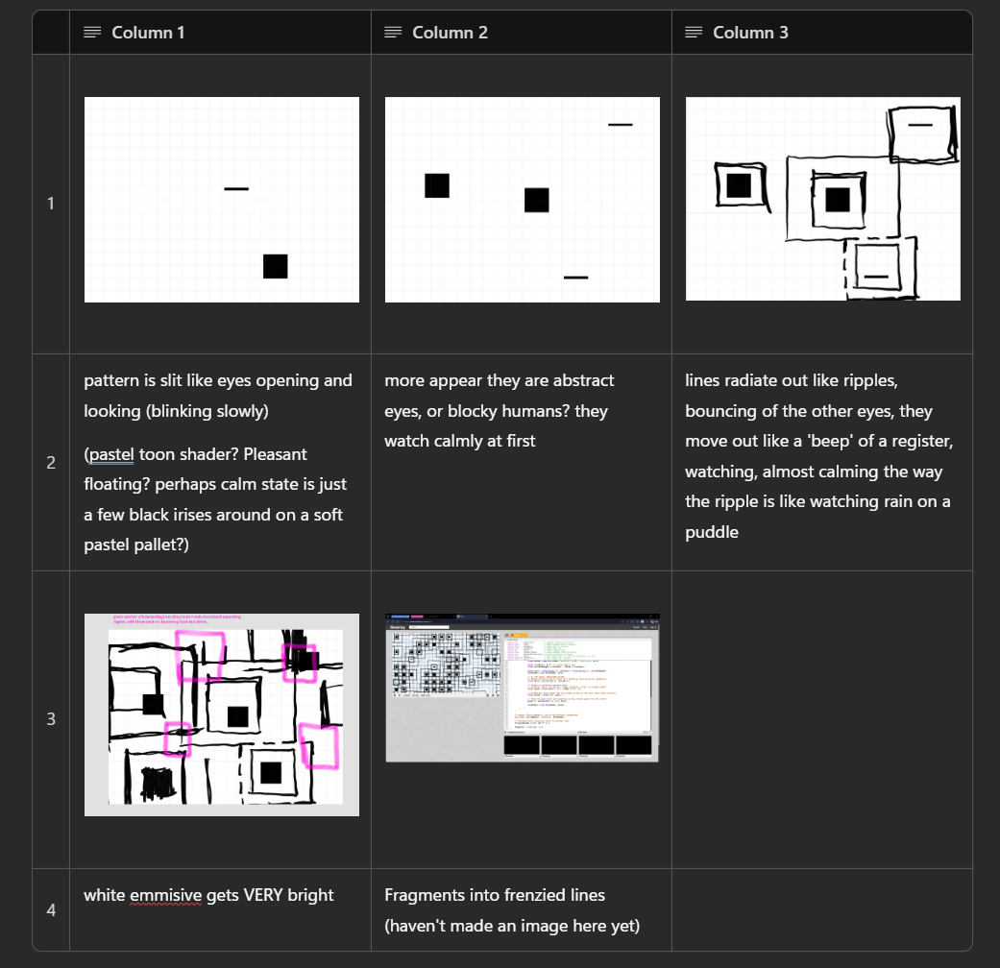
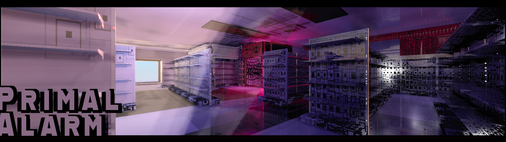
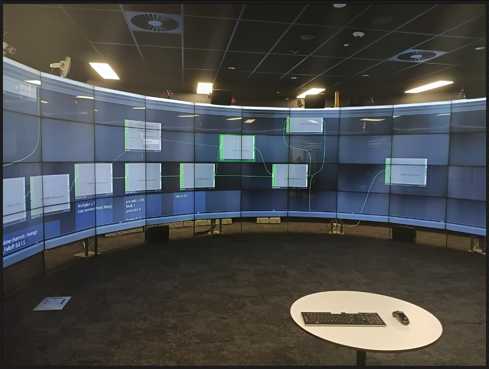

# Journal DES307 - 
30.Feb.2026

# Week 1 - Exploring Interactive Tech
## Entry 1


Starting to gather different moodboards and ideas. Currently thinking about the role of symbols and iconography - a wrap around experience like the Cave has a nice opportunity to lean into how that space would afect a users interaction with visuals or an installation within.


Current thinking is around liminel type spaces, mostly as they are mundane in nature but often refelction of the society they are in often aehsteticaly unpleasing as they are utility driven, being utility driven having repetition of harsh geometric shapes would not only help with asset construction, it was leading down an interesting path surrounding what makes a space visually comforting or discomforting. Not just as 'hostile' architecture but architecture that is so devoid of culture it becomes strangely foreign feeling. These places really set my admitely  high baseline anxiety on edge.

```
Moodboard - Ideation
```
---

## Entry 2 

Interested in the science behind pattern glare and cognitive overload. Especially in digital environments as they can be used as a tool for learning and or training Pilots, Mining, Sparkies plethera of high risk simulatiors.
These types of projects that are used in learning and so visual heirachy and clarity is paramount though from what I see online about these projects (likely due to tight deadlines) the graphical and audio quality is often pefunctary.

Some papers on the subject "How hard is it really" - Andrew Seyderhelm lead me to looking more toward the science of eyestrain or 'glare' showed an interesting paper



"A NEUROLOGICAL BASIS FOR VISUAL DISCOMFORT" (Wilkins, date) 

Pattern glare is the cortical hyperexcitability triggered by certain high-contrast spatial frequencies (Wilkins et al., 1984; Monger et al., 2015) very interesting that is a wholly measurable response.

I had never really explored this side of environment art and it intrigued me not only from a visual design standpoint but as a potential storytelling device. 'This is the chill comfort version' vs 'This is the intense one'



Bridget Lady has some great peices on this


In parallel to this focus had shifted to commercial decay, not as a dark or macabre interest but more when creating an immersive environment it could be potentially too overwhelming. Can always go extreme then dial it back, user controlled intensity or fequency.

## Entry 3



Looking at supermarket scans and panoramic shots, liminal spaces aren't exactly underexplored in gaming or media however are a great source of intentioned visual noise (shelves shouting for your attention). Concerned this space might seem too mundane. I know I don't want to stand in a supermarket for long but was unsure of why.

--- 

# Week2 - Analysis the Why
## Entry 1


Fig2: AI artwork of one of my drawings (left)

### Leading Idea - Task1
The experience begins in a seemingly mundane commercial interior. As the user interacts—via a physical dial or biometric sensors—the "pleasant" vibes dissolve into "dark noise". The modular walls, built in Blender and rendered in Unreal Engine, will shift and distort, using dynamic textures to create a 320-degree field of overwhelming geometric static. TouchDesigner will facilitate the visual programming required to bridge these biometric inputs with the environment’s shifting parameters.

---

The world is modular and built around a single commercial building, but the behaviour of the space changes depending on how the player interacts with it.
Two key systems define this version:
1. The Radio Mechanic (Exterior Interaction)
Instead of the Micro:bit, the player interacts with a radio dial.
Tuning the radio shifts the environment between different “channels”:

pastel suburban calm 
neon geometric overload 
Ikeda‑inspired data patterns 
procedural noise states 
flickering fluorescent lighting 
sound‑reactive distortions 

2. Confronting zone

More abstract in nature

gaussian splat overlays 
radial symmetry / panopticon‑like distortions 
pattern glare 
procedural material flicker 
trigger‑based transitions 
sound‑driven shader behaviour 
This creates a clear distinction between the two units:

## Entry 2

Exploring Shadertoy and GLSL and the testing if AI can convert to HLSL


### Shader toy
```

// Ryoji Ikeda / Non-Place "The Watchers" (V2)
// Persistent Squares, Slow Blinks, Heavy Outward Pulses


float hash(vec2 p) {
    p = fract(p * vec2(123.34, 456.21));
    p += dot(p, p + 45.32);
    return fract(p.x * p.y);
}

void mainImage( out vec4 fragColor, in vec2 fragCoord )
{
    // 1. Setup Coordinates
    vec2 uv = fragCoord / iResolution.y;
    float gridDiv = 8.0; // Size of the shelf 'cells'
    
    // 2. Interaction Control (Mouse X simulates Social Load)
    float socialLoad = iMouse.z > 0.0 ? iMouse.x / iResolution.x : 0.15; 
    
    vec3 bgColor = mix(vec3(0.9, 0.95, 1.0), vec3(1.0), socialLoad);
    float finalMask = 0.0;

    // 3. Expanded Neighbor Loop (5x5 Grid Check)
    // This allows the radiating lines to travel much further across the screen
    for(float y = -2.0; y <= 2.0; y++) {
        for(float x = -2.0; x <= 2.0; x++) {
            
            vec2 neighborOffset = vec2(x, y);
            vec2 id = floor(uv * gridDiv + neighborOffset);
            vec2 gv = fract(uv * gridDiv) - 0.5 - neighborOffset;
            
            float h = hash(id);
            
            // IRIS SPAWN LOGIC: 
            // The square wakes up if its random seed is lower than the Social Load
            if (h < socialLoad) {
                
                // A. THE SLOW BLINK
                // High power (60.0) means it stays open 95% of the time, snapping shut slowly
                float blink = pow(sin(iTime * 0.8 + h * 6.28) * 0.5 + 0.5, 60.0);
                
                float irisSize = 0.15; // Fixed square size
                float currentHeight = irisSize - (blink * irisSize); 
                
                float iris = step(abs(gv.x), irisSize) * step(abs(gv.y), currentHeight);
                finalMask = max(finalMask, iris);
                
                // B. THE THICK, RADIATING PULSES
                // Square distance metric keeps the radiating lines perfectly geometric
                float dist = max(abs(gv.x), abs(gv.y)); 
                
                // Create a continuous outward wave. 
                // Multiply 'dist' to add more rings, multiply 'iTime' to change speed.
                float wave = fract(dist * 2.0 - iTime * 0.4 - h);
                
                // step(0.85, wave) means the line takes up 15% of the wave space (much thicker)
                float pulse = step(0.85, wave); 
                
                // Fade the grid lines out smoothly as they travel away from the center
                pulse *= smoothstep(1.8, 0.0, dist);
                
                finalMask = max(finalMask, pulse);
            }
        }
    }

    // Output: Black geometric ink on White/Pastel background
    vec3 col = mix(bgColor, vec3(0.0), finalMask);
    
    // Blinding white intensity boost at extreme load
    if(socialLoad > 0.9) col *= 1.2;

    fragColor = vec4(col, 1.0);
}


```



---

Early testing of materials.

Squishy Heart sensor:

Briefly explored user movement controlling an abstract or 'beating heart' with a Geometry nodes -> Unreal workflow. More movement or biometrics could cause a speed up or slowdown getting the dopamine going, effectively driving between morph targets, essentially 'driving' the beating heart.

User would be 'in' the beating heart/geometric animation (mesh SFD vertex animation but controlled on a 0-1 scale)

However that is just a technical showcase and doesn't really talk to the purpose of the interaction. Something that has become a key question going into Weeks1 learning materials and readings (Penny)

Shadertoy is a really powerful way to expirement with materials in OpenGL, which ports over well to HLSL (AI does a good job converting this over)

Shaders in this small environment seem relatively cheap on my system. They are calculated persurface so it could really hurt being performant.

Textures could be a flip-book though that would be finicky (although cheap)





# Week 3 - The What
## Entry 1



Prial Alarm Final concept - Task1

Keeping in mind the following information from 
``` The "Trigger" Stimuli: Stripes with a spatial frequency of about 3 cycles per degree (roughly the frequency of a page of single-spaced text held at normal reading distance) are the most common triggers.```


Really engaging with the complete stack for Task1 submission. Mapping out the system, jumping ahead to Mediapipe it almost certainly is the tool I will be using along with touch designer.

## Entry 2

Friday’s lecture with Dr. T. Gifford was a great reality check. My initial pitch was getting tangled with too many ideas and not enough process or ideation on the actual interaction itself which is the crux of the entire project.

Going forward Why is this happening to the user, and what is it actually expressing? The pure science of it was making the concept rigid and stripping away the expressive potential.

Seeing another student's work on Anxiety resonated with me, particularly the concept of actively having to 'control' and manage anxiety. Currently "Non-Place" supermarket from a generic study in visual fatigue into a direct emulation of an overstimulated mind. The modern struggle of masking anxiety is incredibly relatable, and the sterile, liminal environment of an endless supermarket is the perfect stage. It captures that specific, suffocating paradox: feeling completely isolated and invisible, but the second your internal anxiety flares up, the space becomes hostile and it feels like all eyes are suddenly on you.

This thematic shift gives my technical mechanics a solid conceptual backbone. The additive effect of an anxious mind perfectly mirrors a compounding data-overload. To simulate this "chaotic static," with the aggressive, Ryoji Ikeda-style geometric shaders. By mapping these expanding black squares and the persistent, blinking "Watcher" irises in world space, the environment itself becomes the antagonist. Current idea is the more movement detected the more a person has to stay still. The room settles, once that is detected.


## Entry 3
Able to test and explore the Cave2 during the workshop. My current touch designer test worked and reacted to the camera already setup (high downward facing webcam)

Mediapipe was tracking well key insight is only one skelton is tracked at a time.


