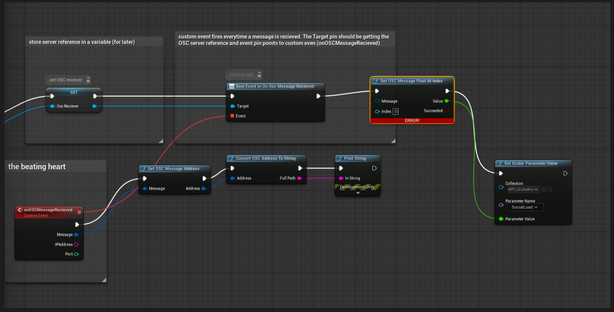
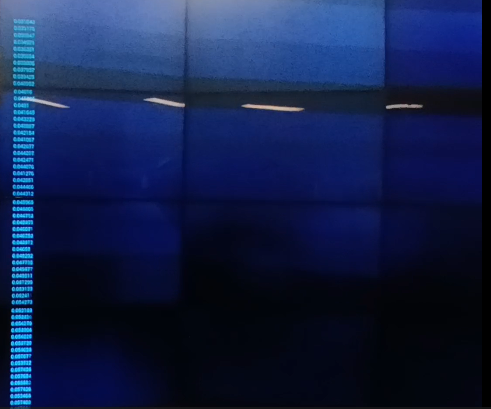

# Week 7
## Entry 1



Covering OSC in detail from the workshop was fascinating, with Dr Toby Giffords help setup a Touchdesigner file using OSC out CHOP ticks a message to localhost (127.0.0.1) being UDP this makes transfer very fast. Also using a DAT callback to visualise the data. This makes it easier to visualise exactly what is being communicated and where (eg a /SocialLoad 0.49385485 is a test from LFO)

Expanding on the Unreal able to create an OSC Blueprint to have an OSC server - get the float, print the string and control the MPC (Material Property Container?). Having it drive a material in realtime was a great milestone.


---

Two separate OSC messages makes the most sense:
- `/presence` (0 or 1) — gates whether the simulation runs at all
- `/socialLoad` (float 0→1) — drives how overwhelming the material gets

The "always pulsing" baseline lives entirely in the material itself (Time node × sine wave). OSC only modulates that pulse — it doesn't trigger it. So the heartbeat is always there, even when no one's in the room. SocialLoad just controls how *agitated* the heartbeat is.

---
# Week 8
## Entry 1
**OSC pipeline, getting it working**

Started building the actual Unreal Blueprint. My OSC receiver was technically working — messages were arriving — but I'd lost my print messages and the float wasn't getting into the Material Parameter Collection.

```
**What each Blueprint node actually does:**
- `Event BeginPlay` → `Create OSCServer` — spins up the listener at startup
- `SET Osc Reciever` — stores the server reference for later
- `Bind Event to On Osc Message Received` — registers the callback
- `onOSCMessageReceived` (custom event) — fires every time a message arrives
- `Get OSC Message Address` → returns the address string like `/socialLoad`
- `Get OSC Message Float At Index` → pulls the actual float value out of the message
```
---


## Entry 2 


Exploring mediapipe today as its the final peice of the puzzel for full end to end functionality

Remembering to externalise the RELEASE tox of media pipe and download the release version.


Seeing this realtime skeleton is always super impressive. Initially I wanted to get face data and use that to look for movement (even as a test) I went with wrists and shoulders. After consulting with AI (prompt below)

*Note: Middle mouse button on operators is a lifesaver for viewing this information.

After some testing going to drop the shoulder tracking and just do wrists 

```
 left_wrist:[xy] right_wrist:[xy]
```

this seems to be the most stable at reading movement. If the Cave2 perhaps wrist bands can increase the detetction confidence?

Lag Chop is trying to smooth out the motions which can be jittery. I think it is also a case of a low quality webcam potentially.

---


## Entry 3 — IT WORKS

Full pipeline operational. LFO ramping in TouchDesigner, OSC sending the float, Unreal receiving it, Material Parameter Collection updating, material visibly responding on the supermarket shelves. Watched the SocialLoad value tick down from 0.88 to 0.72 with the material fading from heavy pattern glare to calm.


---

## Entry 4 — Mapping the actual experience

Sketched out what the experience should feel like at different SocialLoad values. Not two states (calm/chaos) but a gradient with distinct character at each stage:

- **0.0–0.25 Rest** — calm pastel, gentle pulse, low hum. Slightly uncanny but normal.
- **0.25–0.50 Low anxiety** — faint zebra mask appearing, pulse faster (~80 bpm feel), checkout beeps layering. Maybe a "Hello Shopper" PA line.
- **0.50–0.75 Rising overload** — zebra dominates, products losing detail, pulse insistent (~110 bpm), beeps stacking, blood-rush undertone. PA becoming urgent: "Please keep moving."
- **0.75–1.0 Full overload** — Ikeda-style data noise, geometry fracturing, pulse maxed, all sound layers distorted. Maybe drop text entirely — visuals say enough.

Important realisation: this isn't four separate materials. It's ONE material with a SocialLoad input that just *looks like* these things at different points along the 0→1 range. Same math, same shader, different input number.




## Entry 5 

The thing I struggled to articulate but finally got: **SocialLoad is always climbing while someone is in the space.** Movement doesn't win, it just buys time. It's a bathtub with the tap always running. Movement is pulling the plug — drains some water — but the tap never turns off.

The math:

```
SocialLoad = SocialLoad + growthRate − (movement × drainRate)
```

Tunable with two constants. `growthRate` (e.g. 0.010 per frame) and `drainRate` (e.g. 0.030). The only variable input is `movement` from MediaPipe (0 to 1).
```
- **Frozen** (movement = 0) 
- **Fidget** (movement = 0.3) 
- **Walking** (movement = 0.5) 
- **Thrash** (movement = 1.0)
```

This mechanic IS the metaphor. Anxiety doesn't resolve, it requires constant management. The visitor can't fix the space, only manage it. Stop managing → it escalates conceptually the most honest version of the piece.

---

## Week 9 

The material doesn't know about any of the bathtub math. It just receives SocialLoad (0→1) from the MPC and uses it for two things:

1. **Pulse speed** — `Time × Lerp(slow, fast, SocialLoad) → Sine`. At 0 the wave cycles slowly, at 1 it's panicked.
2. **Pulse intensity** — `Sine × Lerp(quiet, loud, SocialLoad)`. At 0 the pulse barely moves anything, at 1 it's driving the full effect.

That single pulsing value plugs into the zebra mask, UV distortion, emissive brightness — whatever visual effect needs to react. Pulse is the engine, SocialLoad is the throttle.

One material. Two lerps. One sine. Everything else is just plumbing.

---


Hard plumbing done. Everything from here is creative work, which is the part I can actually do well.


# Week 10
## Entry 1
Happy with the my pitch deck but not my presentation, ended up going completely off script.

Feedback from Dr Toby Gifford - nudged me toward thinking about proxitimy bubbles for the users as this would serve as their 'window' into the installation - something I want to try and certainly explore.

An interesting limitation is media pipe only tracks one pose/skeleton as its a single person pose estimation which is a core design constraint I will consider.

Currently it is a 'solo' experience, though multiuser interaction could be possible using another data point, possibly faces. This has negative and positives for the artifact - having to do an absurd notion is even more relatable in the context of social anxiety, I would expect people to have trepedation entering into the Cave2 and not knowing what to expect or 'how' to perform.

It will be interesting to see if I can balance that tension, since I don't want it to be a bad experience - if the performance of the people is more joyous and memoriable in a group (which I suspect it would be) I see 

