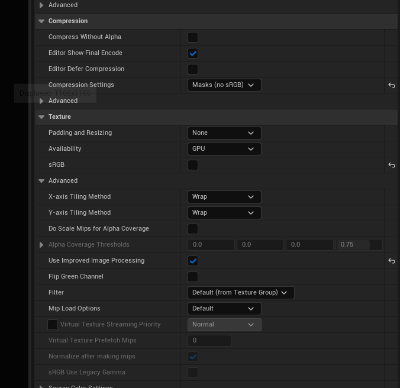
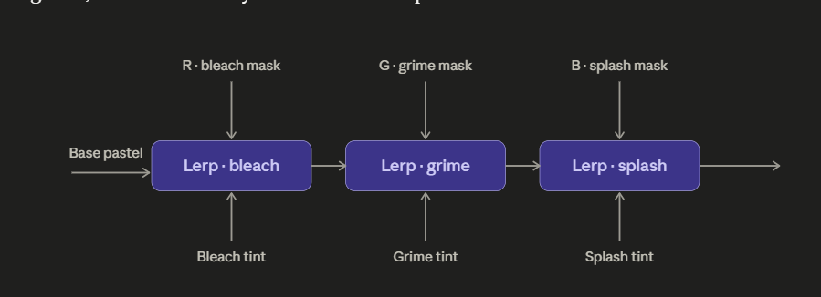
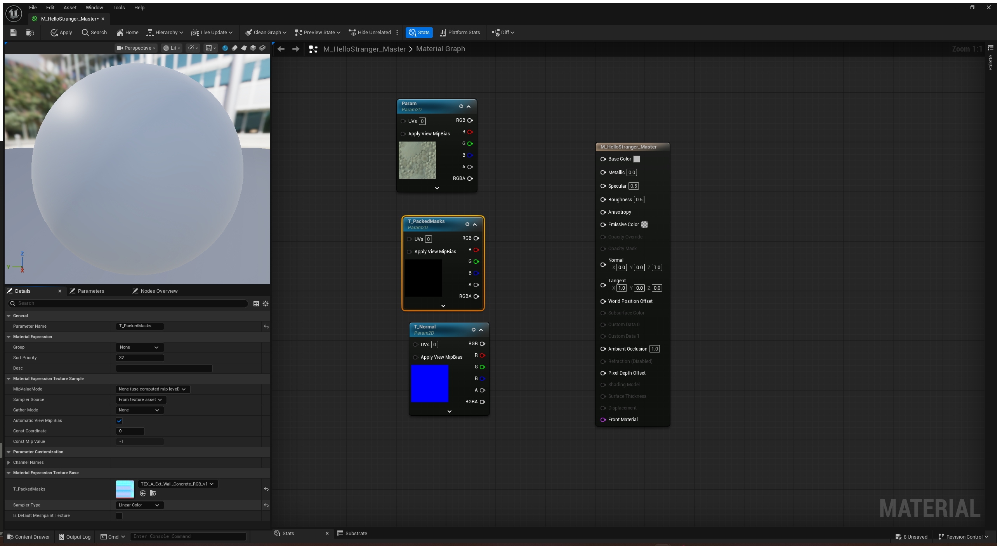
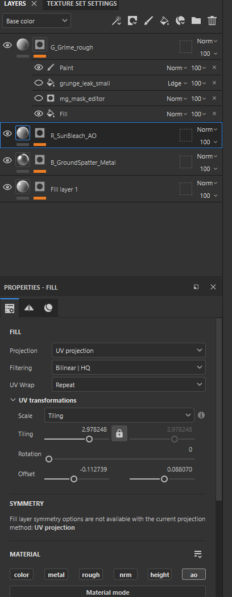
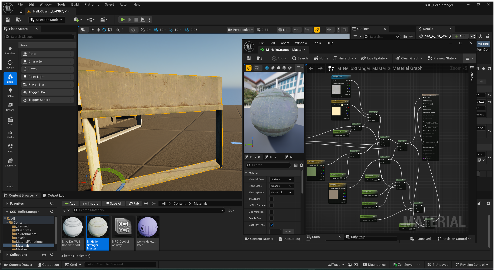

# SGD230 Journal
## 26 April 2026

## Brief OSC distraction

Started toying around with an OSC blueprint from another project. Quick summary Unreal Blueprint listening on UDP port 10000 for **Open Sound Control (OSC)** messages, parsing the address path (e.g. `/SocialLoad`, `/presence`), extracting the float value, and writing it into a **Material Parameter Collection** scalar.

In practice this meant the environment's material state could be driven *live* from an external source — TouchDesigner, Max/MSP, Ableton, a Python script, anything that speaks OSC.

However the security itself would be crazy for a packaged level.

## Why it fit the concept

The thematic core of *Hello Stranger* is the "Economic Mirror": a familiar pastel exterior abstracting into noisy procedural patterns as the player moves deeper, mirroring social/economic anxiety. The procedural shift currently runs on **collision-box triggers** along the player path — deterministic, authored, predictable.

OSC integration would replace (or layer onto) that with **external real-world data**:

- A live anxiety/news-sentiment index driving the abstraction amount
- ASX or housing-price volatility feeding into the pattern intensity
- Ambient social-media velocity scaling the visual noise
- A simple presence sensor (webcam, mic level) tying environmental discomfort to the player's literal physical presence

The environment becomes a *responsive* social barometer rather than a *depicted* one. That's a meaningful conceptual upgrade — it stops being a metaphor and starts being a measurement.

## What's preserved for later

- The conceptual framing above
- The structural pattern: **OSC message → MPC scalar → master material parameter → environment-wide visual state**
- The Blueprint logic itself (rebuildable in ~15 minutes once the plugin is re-enabled)

## Re-activation path

If revisited (Task 3, post-unit portfolio work, or future iteration):

## Reflection note

Cutting this from the project is a no brainer for time, it was always a stretch goal but one I wanted to document as to not forget this potential idea down the track.


## Week 9
### 09.05.2026



For masks turn off compression settings: Masks (no sRGB)
Turn off sRGB 

### Claude: What settings should I change on masks - Claude

``` Quick reason why: sRGB applies a gamma curve designed for how human eyes perceive color. When you uncheck it, the texture is read as linear data — meaning a 50% gray pixel actually equals 0.5 in math. With sRGB on, that same 50% gray reads as ~0.22 in math, which completely breaks Lerp blending. For anything used as a mask, roughness, metallic, AO, or normal map, sRGB should always be off. ```




#### colourmode for masks set to linear, sRGB off for better lerp calculations. If sRGB is enabled it can mess with the math, a 0.5 grey will be 0.5 and not downshifted to 0.22 etc

``` Sampler Type to Linear Color (this is critical — Linear Color tells the material to read the texture as data, not as sRGB-corrected colour). ```

Why paramaters? Using paramaters over texture samples is so the material instances will allow me to swap out textures per module without recompiling that shader. This will be key for a modular kit.

Hit a snag trying for ORM packing the masks, in substance they don't export correctly even though I have been over the settings 100 times. For some reason AO is not baking out to any channel, I wasted a lot of hours on this but it was interesting expirement.

Switching to just using custom user 

 - packing a mask to roughness and metallic works but AO simply won't 

Switching to user inputs on the material (user0,user1,user3) 

Naming Convention for meshes

A_Ext_Wall_Concrete_400x350

This should help with 

Here's the complete walkthrough. I'll structure it as one pass from project creation to UE import. Take it slow — there's a lot of small steps but each one is quick.

---

## Phase 1: Substance Painter project setup

**Step 1 — Create the new project**

File → New. Browse to your low-poly mesh (`SM_A_Ext_Wall_Concrete_400x350_LP.fbx` or whatever it's named). 

In the project setup dialog:
- **Template:** Metal/Roughness (PBR Metallic Roughness)
- **Document Resolution:** 2048 (or 4096 if you want headroom — 2K is plenty for game work)
- **Normal Map Format:** DirectX (matches Unreal)
- **Compute tangent space per fragment:** unchecked (default is fine for game assets)
- Don't add any mesh maps yet — we'll bake those in a moment

Click OK. The project opens with your mesh loaded.

**Step 2 — Bake mesh maps**

In the Texture Set Settings panel (right side, tab next to Layers): scroll to **Mesh Maps** → click **Bake Mesh Maps**.

In the bake dialog:
- Output Size: 2048 (match the document)
- Make sure these are checked: **Normal**, **World Space Normal**, **ID**, **Ambient Occlusion**, **Curvature**, **Position**, **Thickness**
- Bake. Takes a minute.

Even though we're not using PBR channels for our masks, we still want these maps because the Mask Editor generators *read* from them to produce procedural weathering patterns based on geometry.

**Step 3 — Add User Channels**

This is the key step that makes everything else clean.

In Texture Set Settings, find the **Channels** section. You'll see the default PBR channels (Base Color, Roughness, Metallic, etc). Click the **+** button to add new channels. Add three User Channels with these settings:

| Name | Type | Format |
|---|---|---|
| `Sunbleach_R` | User0 | L8 (8-bit grayscale) |
| `Grime_G` | User1 | L8 |
| `Spatter_B` | User2 | L8 |

The naming convention here is intentional — the suffix tells you which file channel each one ends up in (`_R`, `_G`, `_B`). Unambiguous.

While you're in Channels: **disable Metallic** (we don't need it — UE will use a constant). You can also disable Height, Emissive, Opacity if they're enabled — none of those are part of this pipeline. Keep Base Color, Roughness, Normal active for preview purposes (and Normal because we're exporting it).

---

## Phase 2: Layer stack

**Step 4 — Create the base layer**

Layers panel → click the **+ Fill Layer** icon. Rename it to `Base_Concrete`.

In its properties (Material section):
- `color` ✓ enabled — set to your pastel cream/concrete colour
- `metal` ✗ disabled (we just disabled it at the texture set level anyway)
- `rough` ✓ enabled — set to 0.7 (matches your UE constant, just for preview accuracy)
- `nrm` ✗ disabled (no base normal painting, only mesh normal)
- `height` ✗ disabled
- `Sunbleach_R` ✗ disabled
- `Grime_G` ✗ disabled
- `Spatter_B` ✗ disabled

The base layer has no contribution to the mask channels. They start at 0 underneath everything.

**Step 5 — Create the Sunbleach layer**

Layers panel → + Fill Layer. Rename to `Sunbleach_R`.

Properties → Material section. Disable everything *except* `Sunbleach_R`. Set `Sunbleach_R` value to **1.0** (slider all the way right).

Now add a black mask: right-click the layer → **Add black mask**. The mask is now black across the whole mesh, meaning the layer paints nothing — it's invisible. This is our starting point.

Right-click the black mask → **Add effect → Mask Editor (Legacy)** OR **Add effect → Generator → Mask Editor**. The Mask Editor lets you build procedural weathering masks from mesh maps.

Tweak the Mask Editor parameters until the viewport (set the dropdown at top-right of viewport to `Sunbleach_R`) shows white where you want sun bleach to appear — typically upward-facing surfaces, exposed flat areas, edges hit by sunlight. Useful sliders to play with: Position Gradient, World Space Normal, Curvature, AO weights.

If procedural isn't giving you what you want, you can also right-click the mask → **Add paint** and hand-paint adjustments on top.

**Step 6 — Create the Grime layer**

+ Fill Layer. Rename to `Grime_G`.

Properties: disable everything except `Grime_G`. Set `Grime_G` value to 1.0.

Add black mask → Mask Editor. Tune for vertical streaks, recessed/cavity darkening, gravity-based runs. The Curvature and Position Gradient sliders are your friends here. You can also drag a "Drips" or "Water Drips" smart mask onto this layer's mask from the Assets panel for instant streaking patterns — Substance ships with several.

**Step 7 — Create the Spatter layer**

+ Fill Layer. Rename to `Spatter_B`.

Properties: disable everything except `Spatter_B`. Set `Spatter_B` value to 1.0.

Add black mask → Mask Editor. This one wants to concentrate at the bottom of the mesh — Position Gradient pushed toward "low" or "bottom" is the move. You can also use a downward-facing World Space Normal weight.

**Step 8 — Verify the stack**

Your Layers panel from top to bottom should now read:

```
Spatter_B
Grime_G
Sunbleach_R
Base_Concrete
```

(Top of the stack is rendered last, so weathering layers should sit above the base.)

Click each user channel viewport (the dropdown at top-right of the 3D viewport: `Sunbleach_R`, `Grime_G`, `Spatter_B`) and confirm:
- Each viewport shows a black background with white-ish weathering patterns in just one layer's worth of data
- No bleed-through, no other layers' patterns showing
- Base color view still shows the pastel cream concrete with no mask data corrupting it

If any channel is still empty or all-white, the layer setup for that channel is wrong — go back and check the channel toggles on each layer.

---

## Phase 3: Export preset

**Step 9 — Build a clean export preset**

File → Export Textures. Switch to **Output Templates** tab.

Click the **+** next to Presets to create a new one. Name it `SlowMarch_UserChannels_v2` (or whatever — point is it's a fresh preset, not the old hacked-up one).

Now build the outputs from scratch. You want **two** output maps:

**Output 1: Packed weathering masks**
- Click the `R+G+B` button at the top to create an RGB output
- Filename: `T_$mesh_$textureSet_WeatherMasks_M`
- File format: PNG, 8-bit
- Now drag the inputs onto the slots:
  - From the right-hand panel under **Input maps**, find `Sunbleach_R` (your user channel). Drag it onto the **R** slot. Pick **Gray Channel**.
  - Drag `Grime_G` onto the **G** slot. Pick **Gray Channel**.
  - Drag `Spatter_B` onto the **B** slot. Pick **Gray Channel**.

**Output 2: Normal map**
- Click `RGB` to create another output
- Filename: `T_$mesh_$textureSet_N`
- File format: PNG, 8-bit + dithering
- From the right-hand panel under **Converted maps**, find `Normal DirectX`. Drag onto the RGB slot. Pick RGB.

That's it. Two outputs only. Click **Save settings** at the bottom.

**Step 10 — Export**

Switch to the **Settings** tab in the export dialog. Set:
- Output template: `SlowMarch_UserChannels_v2` (the one you just made)
- Output directory: somewhere clean like `D:\SlowMarch_Exports\`
- File type: png
- Size: 2048

Hit **Export**. You should get exactly two files:
- `T_SM_A_Ext_Wall_Concrete_400x350_LP_TEX_A_Ext_Wall_Concrete_V01_WeatherMasks_M.png`
- `T_SM_A_Ext_Wall_Concrete_400x350_LP_TEX_A_Ext_Wall_Concrete_V01_N.png`

(Filenames will be longer than is ideal because of the `$mesh_$textureSet` expansion — feel free to manually shorten them or simplify the filename template if you want).

---

## Phase 4: Unreal import

**Step 11 — Import the textures**

Drag both PNGs into your UE Content Browser, into a sensible folder like `Content/Modules/HelloStranger/Textures/`.

Click the **WeatherMasks_M** texture to open it. In the Details panel:
- **sRGB:** unchecked (it's data, not colour)
- **Compression Settings:** Masks (no sRGB)
- Save.

Click the **Normal** texture. In the Details panel:
- **sRGB:** unchecked (auto on normal compression)
- **Compression Settings:** NormalMap
- Save.

**Step 12 — Verify the channels**

Open `WeatherMasks_M` again. Click R, G, B buttons at the top of the viewer one by one:

- **R** → should show your Sunbleach pattern (sun-bleached areas, upward-facing surfaces)
- **G** → should show your Grime pattern (vertical streaks, drips)
- **B** → should show your Spatter pattern (ground-level mottling)

Three clean masks, each isolated in its own channel. If any channel is wrong, the issue is upstream in Substance — fix there, re-export, reimport. But assuming the layer channel toggles were all correct, this should just work.

**Step 13 — Hook it into the existing master material**

Your `M_HelloStranger_Master` already has the right wiring. Open a Material Instance of it, find the texture parameters:

- `T_PackedMasks` → assign the new `WeatherMasks_M` texture
- `T_Normal` → assign the new `_N` texture
- All your strength scalars (`BleachStrength`, `GrimeStrength`, `SplashStrength`) start at 1.0 — leave them
- Tints are still where you set them (or fix `Tint_Grime` to brown if you haven't already)

Drop the material instance onto a wall mesh in the level. You should see all three weathering layers blended properly.

---

## Naming convention summary

For your reference and consistency across the kit:

| Asset type | Convention | Example |
|---|---|---|
| Substance project | `<MeshName>.spp` | `SM_A_Ext_Wall_Concrete_400x350.spp` |
| Substance user channels | `<MaskName>_<TargetFileChannel>` | `Sunbleach_R`, `Grime_G`, `Spatter_B` |
| Substance layers | Match channel name | `Sunbleach_R`, `Grime_G`, `Spatter_B`, `Base_Concrete` |
| Substance export preset | `<Project>_UserChannels_v#` | `SlowMarch_UserChannels_v2` |
| Exported texture (mask) | `T_<Mesh>_<TextureSet>_WeatherMasks_M.png` | |
| Exported texture (normal) | `T_<Mesh>_<TextureSet>_N.png` | |
| UE Master material | `M_<Project>_Master` | `M_SlowMarch_Master` |
| UE Material instance | `MI_<Project>_<Module>_<Variant>` | `MI_SlowMarch_Wall_v01` |
| UE Texture parameter | `T_<Purpose>` | `T_PackedMasks`, `T_Normal` |
| UE Vector parameter (colours) | `Tint_<Layer>` | `Tint_Bleach`, `Tint_Grime`, `Tint_Splash` |
| UE Scalar parameter (strength) | `<Layer>Strength` | `BleachStrength`, `GrimeStrength`, `SplashStrength` |

---

That's the full pipeline. The big simplification is **Step 3** — by using User Channels named exactly for their target file slot, and keeping every layer to a single channel toggle, the data flow is now: layer paints into channel → channel exports to file slot → UE samples file channel → Lerp uses it as alpha. No remapping, no Mixed AO, no PBR baggage anywhere in the chain.

Take it one phase at a time. Phase 1 (project + user channels) is the most critical part to get right — once those exist, Phase 2 onwards is just standard layer painting. Yell if anything in any phase doesn't match what you see in your version of Substance.

### 11.05.2026




Although it looks complicated lerping three m


Fixed my exports being strange from substance 

Naming convention 

SM_A_EXT_Wall_Concrete_300x200_V1

prefix_group_situ_type_material_widthxheight_version

Good debugging instincts — you spotted the right thing. Two separate problems, one quick fix, one bigger rewiring. Let me hit the easy one first.

---

## Normal map fix

Your wiring is correct (Parameter2D RGB → Normal pin, SamplerType = Normal). The issue is on the *texture asset* side, not the material graph.

In the Content Browser, find your normal map texture (`T_A_EXT_Lintel_Board_wood_N` is the one currently assigned in the master). Double-click to open the texture editor and check:

- **Compression Settings**: must be `Normal Map (DXT5, BC5 on DX11)` — not Default
- **sRGB**: must be unchecked
- **Texture Group**: should be `WorldNormalMap` (helps with mip filtering)

If Compression Settings is set to Default, the texture's being treated as colour data, which produces exactly the blocky/checker-y artefacts visible on your fascia sections. Change it, save, and the normal will render correctly.

The blocky checker pattern on the dark grey modules in your render is the giveaway — that's classic "normal map being decoded as if it were a colour texture" appearance. Compression settings fix it.

Worth doing this same check on every normal map you import for the kit. UE *usually* auto-detects when a texture is named `_N` and sets the compression correctly, but not always — especially with PNG imports.

---

## The colour logic error — diagnosis

I pulled apart your graph dump and found exactly what you suspected. The Bleach chain is wired correctly, but Grime and Splash have the strength multiply on the **wrong side** of the Lerp.

Here's what's currently happening for Grime:

```
Multiply_13:  Tint_Grime × GrimeStrength  →  goes to Grime Lerp's B input (the colour target)
T_PackedMasks G_channel (raw)  →  goes to Grime Lerp's Alpha pin
```

So when `GrimeStrength = 1.0`, B = Tint_Grime, looks correct.
When `GrimeStrength = 0.5`, B = Tint_Grime × 0.5 = a darker, dimmer brown.
When `GrimeStrength = 0.0`, B = (0,0,0) = **pure black**. The grime areas now blend toward black instead of "less grime."

Same wiring error on Splash. You're not turning the effect *off*, you're making it blend toward black.

For Bleach (which works correctly), the multiply is on the alpha side:
```
Multiply_10:  R_mask × BleachStrength  →  goes to Bleach Lerp's Alpha pin
Tint_Bleach  →  goes to Bleach Lerp's B input (the colour, unmodified)
```

This is the correct pattern. Mask × strength controls *how much* of the blend happens. The tint colour stays pure. When strength = 0, the alpha goes to 0, no blend happens, the original colour passes through.

---

## The fix — for the colour chain

Three things to change for Grime:

**1. Grime Multiply (Multiply_13)** — change inputs:
- A: disconnect Tint_Grime. Connect **G channel of T_PackedMasks** instead
- B: keep GrimeStrength

**2. Grime Colour Lerp (Lerp_9)** — change inputs:
- A: stays (Bleach Lerp output)
- B: disconnect from Multiply_13. Connect **Tint_Grime directly** (RGB output of the VectorParameter)
- Alpha: connect to Multiply_13 output (the new mask × strength)

**3. Roughness chains** — fanout the Multiply_13 output:
- Drag a second wire from Multiply_13 output to the Grime Roughness Lerp's Alpha pin (which is currently incorrectly wired — see roughness section below)

Same three changes for Splash:

**1. Splash Multiply (Multiply_15):**
- A: disconnect Tint_Splash. Connect **B channel of T_PackedMasks**
- B: keep SplashStrength

**2. Splash Colour Lerp (Lerp_2):**
- A: stays (Grime Lerp output)
- B: connect Tint_Splash directly
- Alpha: connect Multiply_15 output

**3. Fanout for roughness** as above.

---

## The fix — for the roughness chain

While I was in the graph I noticed the roughness chain alphas got tangled. Currently:

- **Grime Roughness Lerp (Lerp_21)** Alpha = Multiply_15 output (the *Splash* multiply — wrong)
- **Splash Roughness Lerp (Lerp_22)** Alpha = the entire Splash Colour Lerp output (totally wrong — feeding a colour into an alpha pin)

The correct wiring after you've fixed the multiplies above:

- **Bleach Roughness Lerp** Alpha = Multiply_10 output ✓ (already correct)
- **Grime Roughness Lerp** Alpha = Multiply_13 output (the fixed grime multiply)
- **Splash Roughness Lerp** Alpha = Multiply_15 output (the fixed splash multiply)

So each Multiply node fans out twice: once to the colour Lerp's Alpha, once to the roughness Lerp's Alpha. The same `mask × strength` drives both chains for that weathering layer.

---

## Why this matters in test

After these fixes:

- `BleachStrength = 0` → bleach effect vanishes (no colour change, no roughness change in bleach areas)
- `GrimeStrength = 0` → grime effect vanishes (areas show base colour underneath, not black)
- `SplashStrength = 0` → splash effect vanishes
- Setting any strength to 1.0 reproduces the full effect
- Setting strengths between 0 and 1 smoothly scales the contribution

Test by setting all three strengths to 0 — the wall should now look like the pure base texture with no weathering. Then crank each one to 1.0 in isolation to verify each weathering layer reads correctly on its own. Then mix them.

---

## A note on the kit render

The wall on the right reading the weathering correctly is good — that confirms the base logic of the system works when strengths are at default (1.0). The fascia and shop-front modules looking flat-grey-checkered is the normal map compression issue. Once both fixes are in, the kit should start looking consistent.

The teal sign panel and the warm concrete read really nicely. Once you've got the strengths properly dialing the contributions you can start authoring instance variants — "fresh" with low strengths, "weathered" at 1.0, "abandoned" at 1.0 with darker tints — and scatter them across the kit. That's where the modular feel of the assignment really pays off.

Want me to write out the exact node-by-node wire changes as a checklist you can tick through, or is the conceptual fix clear enough to apply directly?

